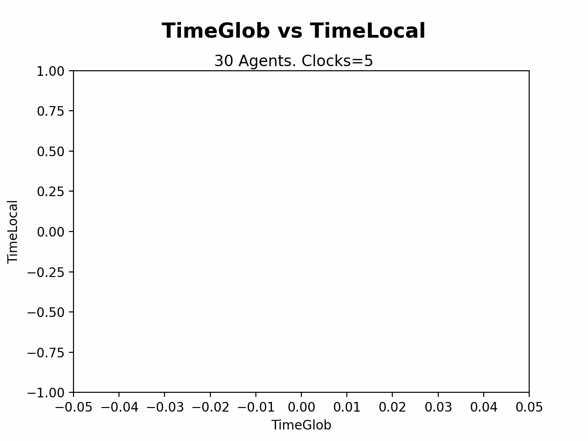
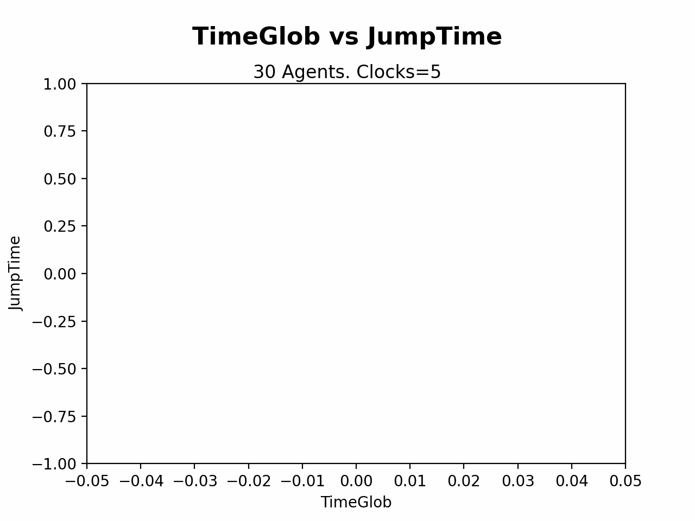

# Engineering Notebook
## Design Problem 2: Logical Clocks

Below we describe some of our thoughts for design exercise two.

#### [Implementation](#implementation-1)

## Implementation

To model each process, our broad strategy will be to create one class which is parametrized by the following (variable) experimental parameters:

* Clock Speed (in ticks/sec)
* Probability of taking an internal action (expressed as a maximum for a random integer)
* A port number
* A list of all other ports with which it should communicate

To encode these hyperparameters, we will store them in `.yaml` config files in a common experiment directory.

Creating new processes will be done by calling `runner.py` with a given config. This runner will create two components:

* A listener thread which constantly monitors the socket for incoming messages, appending them to the network queue---this will ensure that tick speed doesn't yield dropped messages.
* A client thread which implements the logical clock specification and the logic for making internal actions / sends / receives 

Note that, for taking messsages off of the queue, we assume that messages are first-in-first-out. Though another strategy (like LIFO) may yield better performance in our model (since, at the very least, the client would always see the most recent time from its neighbors), this formulation captures the worst-case of a distributed system, in which each agent must work with each message *in order* for the algorithm to run correctly. 

Broadly, `runner.py` contains broad specificiation (like the probabilities of taking each kind of action), and the underlying class in `client.py` encodes the logic for logging, sending/receiving messages, and updating the clock.

## Results

### Observation: Even with equal clocks, queues can grow unboundedly.

Here, we took $n=30$ agents, each with a clock speed of $5$ ticks/second. 

We see that the local times remain within a bounded distance, and the jump times converge to approximately 1. However, the queue length for some agents continues to grow. This is because, in effect, 

The reason why some agents don't have queue growth is most likely because, once an agent has a nonempty queue, it stops sending messages. This means that some set of agents get their queues filled at a steady rate, and all others now only recieve a small set of messages which they can control.

Here is a gif summary of our results:

  
  
  

