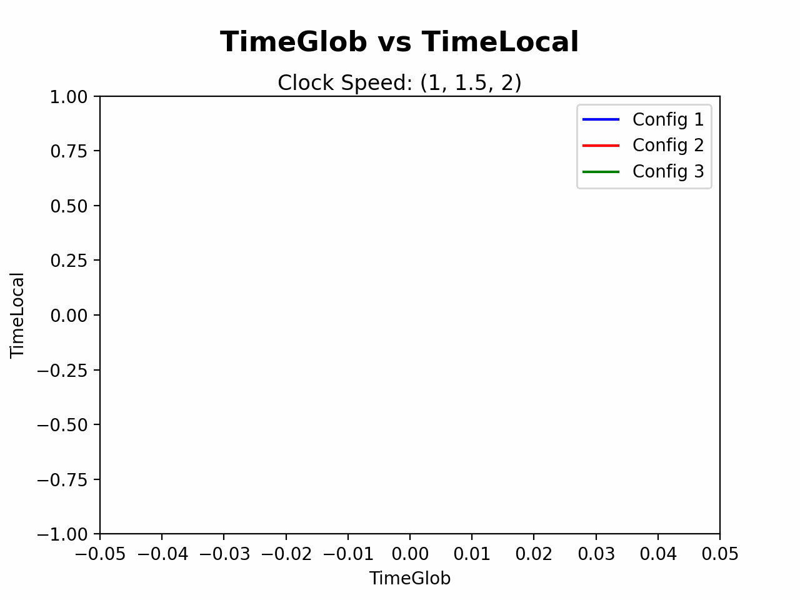

# Engineering Notebook

## Design Problem 2: Logical Clocks


Below we describe some of our thoughts for design exercise two. In the first section, we explain our thought process for the implementation of the model, and in the second, we go over some interesting results.

#### [Implementation](#implementation-1)
#### [Broad Results](#broad-results-1)
#### [Experiment-Specific Results](#detailed-results-for-individual-experiemnts)

## Implementation

To model each process, our broad strategy will be to create one class which is parametrized by the following (variable) experimental parameters:

-   Clock Speed (in ticks/sec)
-   Probability of taking an internal action (expressed as a maximum for a random integer)
-   A port number
-   A list of all other ports with which it should communicate

To encode these hyperparameters, we will store them in `.yaml` config files in a common experiment directory.

Creating new processes will be done by calling `runner.py` with a given config. This runner will create two components:

-   A listener thread which constantly monitors the socket for incoming messages, appending them to the network queue---this will ensure that tick speed doesn't yield dropped messages.
-   A client thread which implements the logical clock specification and the logic for making internal actions / sends / receives.

Note that, for taking messsages off of the queue, we assume that messages are first-in-first-out. Though another strategy (like LIFO) may yield better performance in our model (since, at the very least, the client would always see the most recent time from its neighbors), this formulation captures the worst-case of a distributed system, in which each agent must work with each message _in order_ for the algorithm to run correctly.

Broadly, `runner.py` contains broad specificiation (like the probabilities of taking each kind of action), and the underlying class in `client.py` encodes the logic for logging, sending/receiving messages, and updating the clock.

After you've edited `make_configs.sh` to encode your specifications, running experiments and plotting results is as simple as executing the following:

```
./make_configs.sh
./run_experiment.sh [EXPERIMENT_NAME]
python make_animations.py -e [EXPERIMENT_NAME] -s [Plot Subtitle]
```

### Broad Results

Below we describe general results relevant to the problem specification, including analysis of jump size, time drift, and queue length across settings. For more detailed descriptions of specific experiments, see the section on [Specific Results](#detailed-results-for-individual-experiemnts).

### Jump Sizes

One metric of interest to us is the "jump size" between consecutive operations for a given process. We defined jump size the same way as in EdPost [#76](https://edstem.org/us/courses/69416/discussion/6308559). More specifically, the jump size of a process at time $t$ is the average difference between consecutive operations of the process up to time $t$. The jump time at $t = 0$ is defined to be 0.

It follows directly that the process with the fastest clock speed would have a jump time that is asymptotically one, since after the first time step the consecutive difference is always 1. We would also suspect that processes with slower clocks will have larger jump times since they are more likely to have to update the logical clock to a value that is larger than their predicted next tick value. We see this behavior directly when comparing processes with clock speeds 2, 3, 4.

<center>

</center>

We also wanted to investigate how the relative timings affected the jump size. To this end, we scaled the clock size up and down by 2 and graphed the results. We notice that the overall behavior is exactly the same.

<table align="center" width="100%">
  <tr>
    <td width="50%"></td>
    <td width="50%"></td>
  </tr>
</table>

An additive change to the timings preserves the overall behavior, but does not a seem to provide a consistent effect on the absolute value of the jump size.

<center>

</center>

<!-- Here, we set a distance of

<div style="display: flex; align-items: center;">
  
  
  
</div> -->

### Time Drift

We also were interested in measuring the time drift between the clocks. As in EdPost [#76](https://edstem.org/us/courses/69416/discussion/6308559) we define time drift as the difference in the values of the individual logical clocks at a given time. For varying clock times, we noticed that there is a significant drift between the slowest clock time and the other two clock times. The second fastest clock time does not drift too far away from the fastest clock time.

<center>

</center>

This behavior is preserved when scaling the clock speeds. This indicates that drift of between two clocks seems to be related to their relative (multiplicative) magnitude to one another.

<table align="center" width="100%">
  <tr>
    <td width="50%"></td>
    <td width="50%"></td>
  </tr>
</table>

Further evidence of this is that when we increased the clock speeds of all the clocks by the same amount, the time drift between the clocks dropped significantly. When we added a constant amount to the clock speeds, we ultimately reduced the multiplicative clock ratio which seems to correspond to this decrease in clock drift.

<center>

</center>

### Queue Size

We notice that if a machine has a slow enough clock, then its queue can grow unboundedly.

<center>

</center>

As we describe in detail in later sections, the slowness of a clock seems to depend on its speed relative to other clocks. For example, In the following experiment, we see that even if the clocks are separated by 1 tick/sec each, some processes can have an unbounded queue, and others can have a bounded queue:

<table align="center" width="100%">
  <tr>
    <td width="50%"></td>
    <td width="50%"></td>
  </tr>
</table>

### Internal Event Probability

Internal event probability does seem to have a significant impact on the ability of a process to correct its time. In particular, since reading from a queue always takes priority over the other actions, we find that increasing the internal event probability offers a "buffer" for slow processes to catch up by slowly reading through queues. For example, we see in this case that increasing the internal event probability keeps the average queue size from increasing unboundedly:

<table align="center" width="100%">
  <tr>
    <td width="50%"></td>
    <td width="50%"></td>
  </tr>
</table>


However, in exchange for this, the infrequency of messages means that the slow process will lag behind the faster processes for some time, until it receives a new message:


<table align="center" width="100%">
  <tr>
    <td width="50%"></td>
    <td width="50%"></td>
  </tr>
</table>

This yields highly unstable average jumps:

<table align="center" width="100%">
  <tr>
    <td width="50%"></td>
    <td width="50%"></td>
  </tr>
</table>


### Extra Question: Number of Agents

Another question that we wondered about was whether increasing the number of agents would change the ability of a slower one to maintain its queue. Intuitively, if an agent recieves 3 messages/second from $n$ agents, it is effectively receiving $3n$ messages per second. To test this, we took $n-1$ agents to have clock speed $3$, and $1$ agent to have clock speed $1$. To balance the probabilities of internal events, each setting has a $50\%$ chance of doing an internal, and a $50\%$ chance to perform an external action.

As you can see in the figure below, we actually don't see this behavior change with growing agent counts (similar trends hold for 60 and 100 agents, and with different clock speeds). This may be because, though the number of agents sending messages increases, the effective probability of a sent message going specifically to agent $1$ simultaneously decreases, because there are many more agents who could be the target of a message. 

<table align="center" width="100%">
  <tr>
    <td width="50%"></td>
    <td width="50%"></td>
  </tr>
  <tr>
    <td width="50%"></td>
    <td width="50%"></td>
  </tr>
  <tr>
    <td width="50%"></td>
    <td width="50%"></td>
  </tr>
</table>


## Detailed Results for Individual Experiemnts

Below we describe some specific results found during our experiments.


Many of our experiments concern __Changing Clock Times__ (in ticks/sec). All clients had 6/10 probability of an internal action, and all these experiments had 3 agents. We tested the following clock times:
1. $(1, 1.5, 2)$
2. $(2, 3, 4)$
3. $(4, 6, 8)$
4. $(0.5, 1.5, 3)$
5. $(1, 3, 6)$
6. $(2, 6, 12)$
7. $(0.5, 1.5, 2.5)$
8. $(6, 8, 11)$

Note that experiments 1-3 have constant ratios between clock times, as do experiments 4-6, with 1-3 having "closer" clock speeds than 4-6. Experiment 

Thus, we think about 1-6 as comparing _multiplicative_ relationships between clock speeds, and (2,5) vs (7,8) as testing _additive_ relationships.

### Observation: Close Clocks Maintain Bounded Queues and Time Delays

We found that clocks with similar relative times (1-3) incurred only bounded queue lengths in their slowest members, and as a result their clocks were periodically rectified with the fastest clock, as can be seen in the middle row of plots. We see that, over two minutes, the two slower processes are periodically returned to the local time of the fastest clock.

The top row of charts show that the queue lengths periodically "empty", indicating that each process is able to read all messages over time. Finally, the bottom row of charts indicate that the average jump time---which is higher when processes are further back in time---reaches a steady state for each process. This indicates that the agents are likely to maintain stable time synchronization, as they remain boundedly far behind the fastest clock upon updates. 

We note that this behavior is consistant across uniform multiples of clock speeds. This makes sense, as speeding up all clocks by 2x both doubles the expected rate at which messages are sent and the rate at which agents can read their messages.

<table align="center" width="100%">
  <tr>
    <td width="33%"></td>
    <td width="33%"></td>
    <td width="33%"></td>
  </tr>
  <tr>
    <td width="33%"></td>
    <td width="33%"></td>
    <td width="33%"></td>
  </tr>
  <tr>
    <td width="33%"></td>
    <td width="33%"></td>
    <td width="33%"></td>
  </tr>
</table>

### Observation: Distant Clocks May Yield Unbounded Queues and Time Delays

Conversely, experiments 4-6 show that, when relative clock speeds are sufficiently large, it is possible for the queue to grow unboundedly. As we see in the first row of plots below, the length of the slowest process' queue generally increases, and never returns to 0 after the first few timesteps.

This also yields a gradual desynchronization of the slowest process from the faster ones, as it reads messages which are, by the end of the program, around 40 sends old. However, the faster process is able to keep up, and it doesn't experience this divergence.

Like in the previous case, we see that multiplying all clock speeds by a common factor does not qualitatively impact these results.

<table align="center" width="100%">
  <tr>
    <td width="33%"></td>
    <td width="33%"></td>
    <td width="33%"></td>
  </tr>
  <tr>
    <td width="33%"></td>
    <td width="33%"></td>
    <td width="33%"></td>
  </tr>
  <tr>
    <td width="33%"></td>
    <td width="33%"></td>
    <td width="33%"></td>
  </tr>
</table>

### Observation: Convergence/Divergence is Not Determined by Absolute Differences

In experiments 2 vs 7 and 5 vs 8, we compare the performance of clocks with equal absolute distances.

For example, in the figure below, we compare two processes with inter-clock distances of 2 and 3. The first column, corresponding to slower clocks, has the slowest clock diverging (and queue size growing unboundedly). However, the second plot (with faster clocks) is able to regularly empty its queue.

<table align="center" width="100%">
  <tr>
      <td width="50%"></td>
    <td width="50%"></td>
  </tr>
  <tr>
   <td width="50%"></td>
    <td width="50%"></td>
  </tr>
  <tr>
      <td width="50%"></td>
    <td width="50%"></td>
  </tr>
</table>

Likewise, when the clocks are all absolute distance 1 apart, we see exactly the same difference in behavior:

<table align="center" width="100%">
  <tr>
      <td width="50%"></td>
    <td width="50%"></td>
  </tr>
  <tr>
   <td width="50%"></td>
    <td width="50%"></td>
  </tr>
  <tr>
      <td width="50%"></td>
    <td width="50%"></td>
  </tr>
</table>